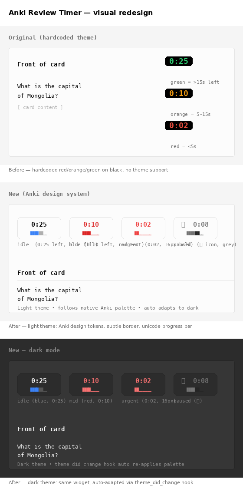

# Anki Review Timer (Redesigned)

A countdown timer add-on for Anki that helps you maintain a steady review pace.

Click the timer to pause/resume.

> **This is a fork of [josh-freeman/anki-review-timer](https://github.com/josh-freeman/anki-review-timer).**
> The behaviour is unchanged; the visual design has been rewritten from scratch to
> follow Anki 25/26's native design system so the widget blends in with the
> rest of the application in both light and dark mode.



## What changed visually

| | Original | This fork |
|---|---|---|
| Background | Hardcoded `rgba(0,0,0,0.7)` (always dark) | `CANVAS_OVERLAY` — adapts to Anki's day/night theme |
| Border | None | `1px BORDER_SUBTLE`, 8px corner radius |
| Color coding | Hardcoded `#e74c3c` / `#f39c12` / `#2ecc71` | Semantic Anki tokens — `FG` / `STATE_LEARN` / `ACCENT_DANGER` |
| Pause indicator | `\|\|` ASCII prefix | `⏸` pause glyph |
| Progress | None | 8-character unicode bar (`█` / `▁`) with two-tone coloring |
| Theme support | None — same colors in light/dark | Auto re-applies palette on `theme_did_change` |
| Font | `Menlo 18 Bold` | `Menlo 15 DemiBold` (16 in urgent state) |

## States

The widget transitions through four semantic states, all driven by Anki's
own color tokens:

| State | When | Text color (light) | Text color (dark) |
|---|---|---|---|
| `idle` | remaining time > 50% | `FG` | `FG` |
| `mid` | remaining 25–50% | `STATE_LEARN` | `STATE_LEARN` |
| `urgent` | remaining ≤ 25% | `ACCENT_DANGER` (16 px) | `ACCENT_DANGER` (16 px) |
| `expired` | timer ran out | `FG_FAINT` | `FG_FAINT` |
| `paused` | user clicked the widget | `FG_DISABLED` | `FG_DISABLED` |

Progress bar fill uses `BORDER_FOCUS` in idle, then matches the text color
in `mid` / `urgent`. Track color uses `FG_FAINT` in idle, then matches the
text color for a single-color hint in the warn states.

## Requirements

- Anki 2.1.50+ (uses `theme.theme_manager.var()` and the `theme_did_change` hook)

## Installation

1. Download the latest release `.ankiaddon` from the Releases page, or clone
   this repo into your Anki add-ons directory:

   ```sh
   git clone https://github.com/FEI352/anki-review-timer.git \
       ~/.local/share/Anki2/addons21/anki-review-timer
   ```

2. Restart Anki.

## Configuration

See [`config.md`](config.md). The defaults match the upstream add-on:

- `timer_duration_seconds` (default `30`)
- `auto_show_answer` (default `true`)
- `show_pause_indicator` (default `true`)

## Credits

- Original add-on by [josh-freeman](https://github.com/josh-freeman/anki-review-timer) (MIT).
- Visual redesign uses Anki's [_aqt.colors](https://github.com/ankitects/anki/blob/main/qt/_aqt/colors.py)
  token system and the [ThemeManager.var()](https://github.com/ankitects/anki/blob/main/qt/aqt/theme.py) helper.

## License

MIT — see [`LICENSE`](LICENSE).
